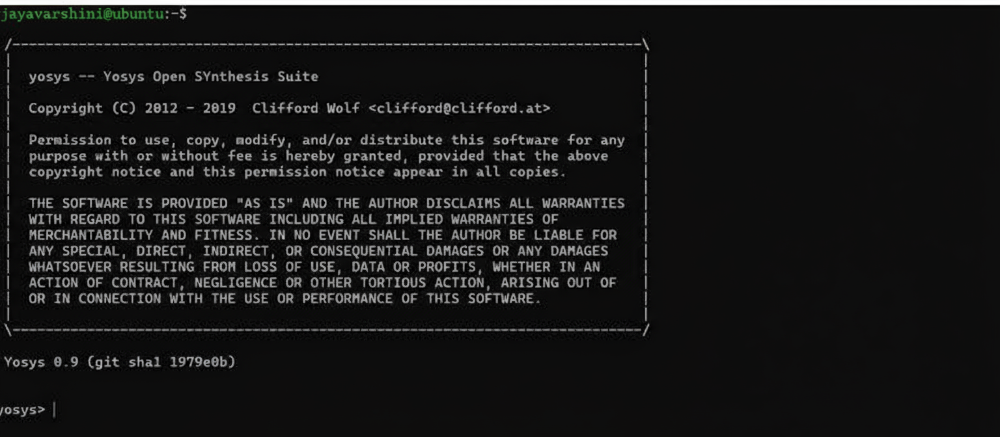

# RISC-V SOC Tapeout Program VSD

## Tools Installation

#### <ins>All the instructions for installation of required tools can be found here:</ins>

### **System Requirements**
- 6 GB RAM
- 50 GB HDD
- Ubuntu 20.04 or higher
- 4 vCPU

### **Resizing the Ubuntu window to fit the screen**
```bash
$ sudo apt update
$ sudo apt install build-essential dkms linux-headers-$(uname -r)
$ cd /media/spatha/VBox_GAs_7.1.8/
$ ./autorun.sh
```

### **TOOL CHECK**

#### <ins>**Yosys**</ins>
```bash
$ sudo apt-get update
$ git clone https://github.com/YosysHQ/yosys.git
$ cd yosys
$ sudo apt install make               # If make is not installed
$ sudo apt-get install build-essential clang bison flex \
    libreadline-dev gawk tcl-dev libffi-dev git \
    graphviz xdot pkg-config python3 libboost-system-dev \
    libboost-python-dev libboost-filesystem-dev zlib1g-dev
$ make config-gcc
# Yosys build depends on a Git submodule called abc, which hasn't been initialized yet. You need to run the following command before running make
$ git submodule update --init --recursive
$ make 
$ sudo make install
```


#### <ins>**Iverilog**</ins>
```bash
$ sudo apt-get update
$ sudo apt-get install iverilog
```


#### <ins>**gtkwave**</ins>
```bash
$ sudo apt-get update
$ sudo apt install gtkwave
```


#  Day 1: Introduction to Verilog RTL Design & Synthesis

Welcome to **Day 1** of the RTL Workshop!  
Today, you'll embark on your journey into digital design by learning Verilog, open-source simulation with **Icarus Verilog (iverilog)**, and the basics of logic synthesis using **Yosys**. This guide will walk you through practical labs, essential concepts, and insightful explanations to help you build a strong foundation in RTL design.

---

##  Table of Contents

1. [What is a Simulator, Design, and Testbench?](#1-what-is-a-simulator-design-and-testbench)
2. [Getting Started with iverilog](#2-getting-started-with-iverilog)
3. [Lab: Simulating a 2-to-1 Multiplexer](#3-lab-simulating-a-2-to-1-multiplexer)
4. [Verilog Code Analysis](#4-verilog-code-analysis)
5. [Introduction to Yosys & Gate Libraries](#5-introduction-to-yosys--gate-libraries)
6. [Synthesis Lab with Yosys](#6-synthesis-lab-with-yosys)
7. [Summary](#7-summary)

---

## 1. What is a Simulator, Design, and Testbench?

###  Simulator

A **simulator** is a software tool that checks your digital circuit’s functionality by applying test inputs and viewing outputs. This helps you verify your design before hardware implementation.

###  Design

The **design** is your Verilog code describing the intended logic functionality.

###  Testbench

A **testbench** is a simulation environment that applies various inputs to your design and checks if the outputs are correct.


---

## 2. Getting Started with iverilog

**iverilog** is an open-source simulator for Verilog. Here’s the typical simulation flow:


- Both the design and testbench are provided as input to iverilog.
- The simulator produces a `.vcd` file for waveform viewing in GTKWave.

---

## 3. Lab: Simulating a 2-to-1 Multiplexer

Let’s simulate a simple **2-to-1 multiplexer** using iverilog!

###  Step 1: Clone the Workshop Repository

```shell
git clone https://github.com/kunalg123/sky130RTLDesignAndSynthesisWorkshop.git
cd sky130RTLDesignAndSynthesisWorkshop/verilog_files
```

###  Step 2: Install Required Tools

```shell
sudo apt install iverilog
sudo apt install gtkwave
```

###  Step 3: Simulate the Design

Compile the design and testbench:

```shell
iverilog good_mux.v tb_good_mux.v
```

Run the simulation:

```shell
./a.out
```

View the waveform:

```shell
gtkwave tb_good_mux.vcd
```


---

## 4. Verilog Code Analysis

**The code for the multiplexer (`good_mux.v`):**

```verilog
module good_mux (input i0, input i1, input sel, output reg y);
always @ (*)
begin
    if(sel)
        y <= i1;
    else 
        y <= i0;
end
endmodule
```

###  **How It Works**

- **Inputs:** `i0`, `i1` (data), `sel` (select line)
- **Output:** `y` (registered output)
- **Logic:** If `sel` is 1, `y` gets `i1`; if `sel` is 0, `y` gets `i0`.

---

## 5. Introduction to Yosys & Gate Libraries

###  What is Yosys?

**Yosys** is a powerful open-source synthesis tool for digital hardware. It takes your Verilog code and converts it into a gate-level netlist—a hardware blueprint.

#### Yosys Features

- **Synthesis:** Converts HDL to a logic circuit
- **Optimization:** Improves speed or area
- **Technology Mapping:** Matches logic to actual hardware cells
- **Verification:** Checks correctness
- **Extensibility:** Supports custom flows

###  Why Do Libraries Have Different Gate "Flavors"?

A `.lib` file contains many versions of each gate (like AND, OR, NOT) with different properties:

- **Performance:** Faster gates for critical paths, slower for power savings
- **Power:** Some gates use less energy
- **Area:** Smaller gates for compact chips
- **Drive Strength:** Stronger gates to drive more load
- **Signal Integrity:** Specialized gates for noise/performance
- **Mapping:** Synthesis tools pick the best flavor for your needs

---

## 6. Synthesis Lab with Yosys

Let’s synthesize the `good_mux` design using Yosys!

###  Step-by-Step Yosys Flow

1. **Start Yosys**
    ```shell
    yosys
    ```

2. **Read the liberty library**
    ```shell
    read_liberty -lib /address/to/your/sky130/file/sky130_fd_sc_hd__tt_025C_1v80.lib
    ```

3. **Read the Verilog code**
    ```shell
    read_verilog /home/vsduser/VLSI/sky130RTLDesignAndSynthesisWorkshop/verilog_files/good_mux.v
    ```

4. **Synthesize the design**
    ```shell
    synth -top good_mux
    ```

5. **Technology mapping**
    ```shell
    abc -liberty /address/to/your/sky130/file/sky130_fd_sc_hd__tt_025C_1v80.lib
    ```

6. **Visualize the gate-level netlist**
    ```shell
    show
    ```


---

## 7. Summary

- You learned about simulators, designs, and testbenches.
- You ran your first Verilog simulation with iverilog and visualized waveforms.
- You analyzed the 2-to-1 mux code.
- You explored Yosys and learned why gate libraries have various flavors.


---


